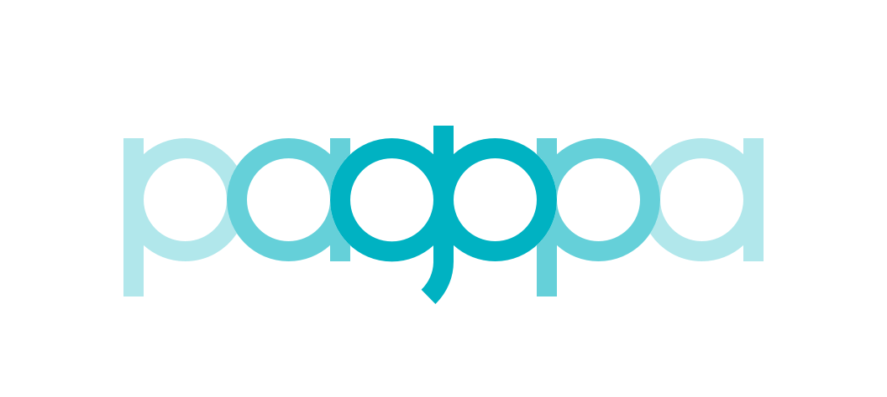

+---------------+
| |PagoPA_logo| |
+---------------+

**Gruppo A - Domande frequenti di carattere generale**
=======================================================

A1: Cos'è pagoPA?
-----------------
pagoPA è un sistema per rendere più semplici, sicuri e trasparenti tutti i pagamenti verso la Pubblica Amministrazione. pagoPA è adottato obbligatoriamente da tutte le Pubbliche Amministrazioni e dagli altri soggetti obbligati per legge e da un numero crescente di Banche e di istituti   di pagamento (Prestatori di Servizi a Pagamento - PSP). pagoPA è previsto in attuazione dell’art. 5 del CAD (Codice dell’Amministrazione Digitale) e   dal D.L. 179/2012.
pagoPA nasce per specifici motivi:

    - incrementare l’uso di modalità elettroniche di pagamento a livello di sistema Paese in considerazione del fatto che, i pagamenti verso gli Enti Creditori, sono rilevanti per numero di transazioni e volumi;
    - rendere il cittadino libero di scegliere come pagare, dando evidenza dei costi di commissione;
    - ridurre i costi di gestione degli incassi per gli Enti Creditori;
    - standardizzare a livello nazionale le modalità elettroniche di pagamento verso gli Enti Creditori;

*Parole chiave: pagamenti elettronici*

A2: Cosa posso pagare con pagoPA?
---------------------------------
pagoPA permette di pagare tributi, tasse, utenze, rette, quote associative, bolli e qualsiasi altro tipo di pagamento verso le Pubbliche Amministrazioni centrali e locali, ma anche verso altri soggetti, come le aziende a partecipazione pubblica, le scuole, le università, le ASL.
pagoPA non è un sito dove pagare, ma un sistema di pagamenti standard adottato da Banche e altri istituti di pagamento. Si possono effettuare i pagamenti direttamente sul sito o sull’app dell’Ente Creditore (il tuo comune, ad esempio) o attraverso i canali (online e fisici) di banche e altri Prestatori di Servizio a Pagamento (PSP), ovvero:
    - presso le agenzie della tua banca;
    - utilizzando l'home banking della tua banca (dove trovi i loghi CBILL o pagoPA);
    - presso gli sportelli ATM della tua banca (se abilitati);
    - presso i punti vendita di SISAL, Lottomatica e ITB;
    - presso le Poste, se il canale è attivato dall’Ente Creditore che ha inviato l'avviso.

A3: Con pagoPA posso anche riscuotere crediti verso la pubblica amministrazione?
--------------------------------------------------------------------------------
No, il sistema pagoPA permette solo pagamenti verso la Pubblica Amministrazione.

A4: Quali sono i vantaggi di pagoPA per i cittadini?
----------------------------------------------------
Il principale vantaggio di utilizzare il sistema pagoPA è quello di affidarsi ad un sistema unico di pagamento, semplice, rapido e
trasparente (certezza dei costi di commissione, chiarezza degli importi, ecc.), per effettuare qualsiasi tipo di pagamento verso la Pubblica Amministrazione.
In particolare:
    - multicanalità integrata a livello nazionale con trasparenza dei costi delle commissioni
    - uniformità dell'avviso di pagamento e possibilità di avvisare il cittadino digitalmente sui canali che preferisce (notifiche sull’app o sul sito     del PSP scelto, SMS o mail);
    - certezza del debito dovuto, con possibilità di ottenere l'attualizzazione dell'importo, ossia l’importo da pagare è sempre quello valido e     richiesto dall’Ente Creditore (se l’importo varia nel tempo per interessi di mora o altro, su pagoPA viene sempre aggiornato);
    - semplicità e velocità del processo: basta inserire il codice di avviso (IUV Identificativo Unico Versamento) per pagare e ricevere la quietanza     liberatoria ovvero la certezza che l’Ente Creditore ha incassato il tributo e non potranno esserci verifiche o accertamenti successivi.

A5: Quali sono i vantaggi di pagoPA per le Pubbliche Amministrazioni?
-----------------------------------------------------------------
Il sistema pagoPA permette agli Enti Creditori di utilizzare un sistema semplice, standardizzato, non oneroso
per ricevere qualsiasi tipo di pagamento. Tra i vantaggi, pagoPA permette di ridurre i costi per ricevere e gestire
i pagamenti e di automatizzare gli incassi, rendendone più facile ed efficiente la gestione.

A6: È obbligatorio per un Ente pubblico offrire come metodo di pagamento pagoPA?
--------------------------------------------------------------------------------
Le Pubbliche Amministrazioni sono tenute per legge ad aderire al sistema di pagamento pagoPA. Le PA che non hanno rapporti diretti con
cittadini e imprese, possono essere esentate dall’adesione al sistema, purché abbiano inviato a PagoPA S.p.A. tramite Pec (presidio@pec.pagopa.it) la `specifica dichiarazione <https://github.com/italia/lg-pagopa-docs/blob/master/documentazione_tecnica_collegata/faq/c7_dichiarazione_ente_per_censimento_iban_tramite_altro_ec_1_0.doc>`_ per tale esenzione.
L’obbligo di adesione al sistema pagoPA è esteso anche ai gestori di pubblici servizi e alle società a controllo pubblico.
Il D.Lgs. n. 179/2016 (G.U. n. 214 del 13.9.2016) e il D.Lgs n. 217/2017 (G.U. n. 9 del 12.01.2018) hanno rispettivamente modificato e corretto  l’articolo 2, comma 2, del CAD introducendo nel perimetro soggettivo del CAD anche i gestori di pubblici servizi e le società a controllo pubblico,    come definite nel decreto legislativo adottato in attuazione dell’articolo 18 della legge n. 124 del 2015, escluse le società quotate. Il D.Lgs. n.        175/2016, all’articolo 2, lettera m), ha delineato il concetto di società a controllo pubblico. In particolare, le società a controllo pubblico sono  definite come quelle società in cui una o più amministrazioni pubbliche esercitano poteri di controllo ai sensi dell'articolo 2359 del codice civile, e precisamente:

    1. le società in cui un'altra società dispone della maggioranza dei voti esercitabili nell'assemblea ordinaria;
    2. le società in cui un'altra società dispone di voti sufficienti per esercitare un'influenza dominante nell'assemblea ordinaria;
    3. le società che sono sotto influenza dominante di un'altra società in virtù di particolari vincoli contrattuali con essa.

L’articolo 2359 del codice civile precisa che ai fini dell'applicazione dei numeri 1) e 2) che precedono “si computano anche i voti spettanti a       società controllate, a società fiduciarie e a persona interposta; non si computano i voti spettanti per conto di terzi. Sono considerate collegate       le società sulle quali un'altra società esercita un'influenza notevole. L'influenza si presume quando nell'assemblea ordinaria può essere esercitato  almeno un quinto dei voti ovvero un decimo se la società ha azioni quotate in borsa”.

Infine, all’articolo 2 del D.Lgs. n. 175/2016 è ulteriormente precisato che “Il controllo può sussistere anche quando, in applicazione di norme di       legge o statutarie o di patti parasociali, per le decisioni finanziarie e gestionali strategiche relative all'attività sociale è richiesto il       consenso unanime di tutte le parti che condividono il controllo”.

*Parole chiave: obbligatorietà*

A7: Che cosa è il Nodo dei Pagamenti-SPC?
----------------------------------------
Il Nodo dei Pagamenti-SPC è un’infrastruttura tecnologica unitaria, basata su regole e specifiche standard, che offre una modalità
semplificata e uniforme per garantire l'interoperabilità tra gli Enti Creditori aderenti e i Prestatori di servizi di pagamento per
l’effettuazione dei pagamenti.
Tale infrastruttura non è una piattaforma di pagamento, ma permette al pagatore di richiedere l’esecuzione del pagamento a favore del
soggetto aderente al sistema pagoPA, scegliendo la modalità di pagamento preferita, avendo, al contempo, la garanzia della rapidità e
della piena trasparenza del pagamento stesso.

A8: Quali sono i soggetti che devono o possono aderire al Nodo dei Pagamenti-SPC?
---------------------------------------------------------------------------------
Per identificare i soggetti obbligati ad aderire al Sistema pagoPA è necessario fare riferimento sia all’articolo 5 del CAD, sia
all’articolo 15, comma 5bis, del D.L. 179/2012 come convertito in legge, poiché tale secondo articolo stabilisce che le Pubbliche Amministrazioni
sono obbligate ad aderire all’infrastruttura del Nodo dei Pagamenti-SPC. L’adesione resta, altresì, obbligatoria per i soggetti di cui all’articolo     2 del CAD che stabilisce, appunto, l’ambito soggettivo di applicazione dell’articolo 5 del CAD e che obbliga all’adesione a pagoPA dei gestori di     pubblici servizi e anche delle società a controllo pubblico, come definite nel decreto legislativo adottato in attuazione dell’articolo
18 della legge n. 124 del 2015, escluse le società quotate.
Pertanto, l’adesione rimane facoltativa solo per i Prestatori di servizi di pagamento e per i soggetti non obbligati per legge che ne facciamo
espressa richiesta a PagoPA S.p.A. che ne valuterà la relativa opportunità e fattibilità.
Per ulteriori dettagli, si rimanda alle domande **GRUPPO B – FAQ AMBITO NORMATIVO - B1, B2, B3 e B4**.

*Parole chiave: obbligatorietà*

A9: Quali sono gli strumenti di pagamento e i canali utilizzabili?
------------------------------------------------------------------
Con l’adesione al Nodo dei Pagamenti-SPC, l’Ente Creditore può automaticamente, senza costi aggiuntivi, né necessità di convenzionamenti
con i PSP, mettere a disposizione del cittadino i seguenti strumenti e canali di pagamento elettronico:
    - il bonifico bancario o postale ovvero il bollettino postale
    - versamenti effettuati con «carte di debito, di credito, prepagate ovvero di altri strumenti di pagamento elettronico disponibili, che consentano anche l'addebito in conto corrente», avvalendosi dei prestatori di servizi di pagamento individuati secondo la procedura di cui al comma 1, lettera b) dell’art. 5 del CAD.

I pagamenti di cui al punto 2) possono essere effettuati presso ATM o POS fisici o virtuali messi a disposizione dai Prestatori di Servizi di Pagamento ovvero essere eseguiti autorizzando addebiti diretti da parte dell’utilizzatore finale.

*Parole chiave: PSP*

A10: Quali sono i modelli di pagamento previsti?
------------------------------------------------
I modelli di pagamento previsti da pagoPA sono:
    - Modello 1: pagamento contestuale all’erogazione del servizio da parte dell’Ente Creditore tramite il suo portale (pagamento in tempo reale)
    - Modello 2: pagamento differito rispetto all’erogazione del servizio da parte dell’Ente Creditore tramite il suo portale (incasso pre-autorizzato)
    - Modello 3: pagamento eseguito tramite il canale del prestatore del servizio di pagamento prescelto (tipicamente canale fisico - Uffici Postali,       Ricevitorie, Tabaccherie, ATM Bancomat, etc.)

Per la descrizione dettagliata dei modelli di pagamento si rimanda alla documentazione disponibile sul sito di `pagoPA <https://www.pagopa.gov.it/>`_ . Si precisa che,
a prescindere al modello di pagamento utilizzato, in linea con quanto previsto dalla direttiva europea in materia di servizi di pagamento,
l’ordine di  pagamento ricevuto dal PSP è irrevocabile da parte dell’utilizzatore finale. Pertanto, una volta che l’utilizzatore finale abbia richiesto al PSP di       eseguire l’operazione di pagamento nei confronti dell’Ente Creditore, il pagatore e il PSP non potranno mai revocare l’ordine di pagamento
ovvero  pregiudicare il carattere definitivo della relativa operazione di pagamento.

*Parole chiave: PSP*

A11: Quanti sono i PSP aderenti a pagoPA?
-----------------------------------------
Sul sito di pagoPA è possibile consultare l’ `elenco completo dei Prestatori di Servizi di Pagamento (PSP) <https://www.pagopa.gov.it/it/dove-pagare/>`_.

*Parole chiave: PSP*

A12: Che differenza c’è tra CBILL e pagoPA?
-------------------------------------------
CBILL è un logo commerciale delle banche che identifica la piattaforma di pagamento delle banche disponibile anche per gli Enti Creditori.
La piattaforma di pagamento CBILL si può utilizzare attraverso l’Home Banking o gli ATM ed è integrata a pagoPA, nel senso che tutti i pagamenti
effettuati attraverso CBILL, utilizzando un codice identificativo del sistema pagoPA (IUV), sono gestiti da pagoPA.

*Parole chiave: PSP*

A13: Ci sono differenze di costo tra i diversi Prestatori di Servizio a Pagamento?
----------------------------------------------------------------------------------
Si. Ogni istituto che gestisce in pagamenti con pagoPA (Prestatori di Servizi a Pagamento) può applicare autonomamente differenti costi, a  seconda delle proprie politiche commerciali e delle condizioni contrattuali dell’utente.

*Parole chiave: PSP*

A14: Perché con pagoPA sembra di pagare di più?
-----------------------------------------------
Con pagoPA le commissioni, nella peggiore delle ipotesi, rimangono invariate rispetto ai casi in cui pagoPA non è usato. La differenza è
che, con pagoPA, le commissioni vengono esposte in modo trasparente al cittadino, che potrà rendersi conto come tendenzialmente i costi si riducono.
Prima dell’introduzione di pagoPA in molti casi era l’Ente Creditore a inglobare i costi di commissione all’interno del tributo o del servizio.
Il costo di commissione, quindi, rimaneva nascosto al cittadino ma comunque presente.
Negli altri casi il costo di commissione era esplicito. Ad esempio, il pagamento con il bollettino postale o con un avviso in banca comporta un
costo di commissione, anche se pagato con l’home banking.
Nel pagamento di un F24, ad esempio, il cittadino non paga commissioni ma i costi sono a carico dell'Agenzia delle Entrate e quindi ricadono in modo       indiretto sulla fiscalità generale. L'Agenzia delle Entrate infatti paga alle banche una commissione per ogni F24 pagato in via telematica o presso       uno sportello bancario.
Questa tabella mostra alcuni esempi di come cambiano i costi di commissione per il pagamento di un servizio prima e dopo  l’introduzione di pagoPA:

+---------------------+----------------------------------------+------------------------------------------------------------------------------------+
| Canali di  pagamento| Commissioni prima di pagoPA            | con pagoPA                                                                         |
|                     |                                        |                                                                                    |
+=====================+========================================+====================================================================================+
| Home                | Variabili in base al rapporto Banca-   | Variabili, a partire da zero, in base al rapporto Banca-Cliente.                   |
| Banking/C BILL      | Cliente e in base alla Banca scelta    |                                                                                    |
|                     |                                        |                                                                                    |
+---------------------+----------------------------------------+------------------------------------------------------------------------------------+
| Non superiori       |                                        |                                                                                    |
| rispetto a prima    |                                        |                                                                                    |
|                     |                                        |                                                                                    |
|                     |                                        |                                                                                    |
+---------------------+----------------------------------------+------------------------------------------------------------------------------------+
| Agenzie  Bancarie   | A partire da 2 Euro e dipendenti dalla | A partire da 1,30 Euro dipendenti dalla Banca scelta. Servizio disponibile presso  |
| e ATM (1)           | Banca. Non disponibile in tutti gli    | tutti i PSP aderenti a pagoPA                                                      |
|                     | Istituti.                              |                                                                                    |
+---------------------+----------------------------------------+------------------------------------------------------------------------------------+
| Sito della          | Non sempre il servizio era             | Il cittadino paga in base al PSP e allo strumento che sceglie (Conto corrente,     |
| PA/Comune           | disponibile. Quando disponibile le     | carta di credito, altro). In alcuni casi le commissioni sono pari a 0 quando si    |
|                     | commissioni erano imposte dalla Banca  | paga con addebito in conto (es. Banca Intesa, Banco di Napoli, CR Veneto, altre).  |
|                     | Tesoriera scelta dalla PA e assorbite  | Sulla carta di credito grazie alla tecnologia di pagoPA i costi di commissione     |
|                     | dalla PA                               | sono ottimizzati                                                                   |
+---------------------+----------------------------------------+------------------------------------------------------------------------------------+
| POSTE tramite       | 1,10 - 1,50 Euro                       | 1,10 - 1,50 Euro                                                                   |
| bollettino postale  |                                        |                                                                                    |
| (1) (2)             |                                        |                                                                                    |
|                     |                                        |                                                                                    |
+---------------------+----------------------------------------+------------------------------------------------------------------------------------+
| Sisal (1) (2)       | 2 Euro                                 | 2 Euro                                                                             |
+---------------------+----------------------------------------+------------------------------------------------------------------------------------+
| Lottomatica         | 2 Euro                                 | 2 Euro                                                                             |
| (1) (2)             |                                        |                                                                                    |
+---------------------+----------------------------------------+------------------------------------------------------------------------------------+
| Banca 5             | 2 Euro                                 | 1,70 Euro (in promozione fino a data da definirsi)                                 |
| (ITB) (1)           |                                        |                                                                                    |
| (2)                 |                                        |                                                                                    |
+---------------------+----------------------------------------+------------------------------------------------------------------------------------+
| PayPAL              | Non sempre disponibile                 | In base al tipo di carta o al tipo di conto. Condizioni di favore per pagoPA:      |
| (2)                 |                                        |                                                                                    |
+---------------------+----------------------------------------+------------------------------------------------------------------------------------+
| 1,50 Euro           |                                        |                                                                                    |
| (indipendente       |                                        |                                                                                    |
| dall’importo)       |                                        |                                                                                    |
+---------------------+----------------------------------------+------------------------------------------------------------------------------------+
| Supermercati        | In base alla catena                    | In base alla catena                                                                |
| (GDO) (1)  (2)      |                                        |                                                                                    |
+---------------------+----------------------------------------+------------------------------------------------------------------------------------+
| F24                 | Gratuito per il cittadino (le          | ND                                                                                 |
|                     | commissioni vengono assorbite dallo    |                                                                                    |
|                     | stato)                                 |                                                                                    |
+---------------------+----------------------------------------+------------------------------------------------------------------------------------+
| Pagamento presso    | Contante o carta di credito. La        | A breve disponibili attraverso POS fisici integrati con pagamento tramite carta    |
| sportelli fisici    | commissione dipende dall’accordo di    | di credito.                                                                        |
| della PA            | tesoreria e viene assorbito dalla PA   |                                                                                    |
+---------------------+----------------------------------------+------------------------------------------------------------------------------------+
| Satispay            | Non disponibile                        | 0 euro fino a 10 Euro e 0,20 per importi superiori                                 |
+---------------------+----------------------------------------+------------------------------------------------------------------------------------+

**Note**

1. in questi casi il pagamento può avvenire con carta di credito/debito o contante.
2. da notare che con pagoPA, l’esercente potrebbe non richiedere, in aggiunta alla commissione, ulteriori agi e/o oneri connessi all’attività di    riscossione di tributi, con l’effetto, che nel complesso l’operazione di pagamento potrebbe risultare più economica per il cittadino.

*Parole chiave: PSP*

A15: Perché devo pagare le commissioni?
---------------------------------------
A fronte dell’erogazione di un servizio di pagamento, il pagatore è chiamato a corrispondere al suo PSP una commissione. Le commissioni per la
gestione del pagamento sono causate da alcuni costi di servizio che i PSP sostengono per garantire un servizio di qualità: ad  esempio, la
continuità di erogazione h24x365, i tempi di esecuzione delle transazioni che devono essere molto bassi, costi dei circuiti internazionali nel caso
di pagamento con carta di credito, sicurezza e servizi anti-frode, affidabilità dell’infrastruttura, etc (vedi anche FAQ A16, A17 e A18).

*Parole chiave: PSP*

A16: Perché con pagoPA si dovrebbero ridurre le commissioni?
------------------------------------------------------------
Il potere contrattuale di qualsiasi ente, anche di grandi dimensioni, è certamente inferiore a quello della Pubblica Amministrazione italiana nel suo complesso: per questo i PSP garantiscono a pagoPA un trattamento quasi sempre più vantaggioso.

Inoltre, la trasparenza dei costi di commissione dovrebbe incentivare la concorrenza, livellando verso il basso i costi di commissione: ad esempio, se vedo che la mia banca mi fa pagare una commissione alta per pagare con conto corrente posso scegliere la carta di credito, anche con un altro istituto (vedi anche FAQ A15, A17 e A18).

*Parole chiave: PSP*

A17: Posso pagare con carta di credito anche con pagoPA?
--------------------------------------------------------
Si. Con la nuova versione dell’interfaccia di pagoPA, il pagamento con carta avviene con il semplice inserimento dei dati
(numero, data di scadenza, CVV). pagoPA si occupa poi di individuare il PSP più conveniente per il cittadino in base ai dati
della carta fornita, ferma restando per il cittadino la facoltà di modificare tale suggerimento (vedi anche FAQ A15, A16 e A18).
Potrebbero ancora esserci però siti che espongono la vecchia interfaccia utente, nella quale, fatta la scelta della carta come
strumento per il pagamento, è poi richiesto al pagatore di selezionare il circuito (VISA, Mastercard, AMEX, ecc.) e poi il PSP che voglio
gestisca il pagamento.

*Parole chiave: PSP, carta*

A18: Perché con l’attuale pagoPA se devo pagare con la mia carta di credito o debito, devo prima scegliere un PSP?
------------------------------------------------------------------------------------------------------------------
La logica di pagoPA è quella, concordata con Banca d’Italia, di fare in modo che sia sempre il cittadino a scegliere il PSP con cui svolgere
il servizio di pagamento, anche al fine di scegliere le commissioni da pagare. Ed è così che ragiona l’interfaccia utente attuale. Anche per i pagamenti con carta per i quali sia richiesto semplicemente di inserire il numero carta, la data di scadenza e il CVV, e il PSP sia       selezionato automaticamente dall’interfaccia, tale selezione è un mero suggerimento all’utente su quale sia il PSP che risulta essere per lui il più       conveniente ed adeguato, ferma restando la possibilità del pagatore di selezionare un diverso PSP (vedi anche FAQ A15, A16 e A17).

*Parole chiave: PSP, carta*

A19: Le operazioni eseguite con carta di credito con pagoPA possono essere disconosciute o comunque stornate in favore del pagatore?
------------------------------------------------------------------------------------------------------------------------------------
Con pagoPA, la carta di credito rappresenta solo uno degli strumenti che il cittadino può utilizzare.
Come per qualsiasi pagamento con carta di credito, il cittadino ha il diritto di disconoscere un’operazione che non ha autorizzato (ad esempio in caso di smarrimento della carta o clonazione della stessa), previa denuncia e blocco della carta, oppure contestando l’addebito entro 60 giorni   dalla ricezione dell'estratto conto. L’istituto di pagamento (Prestatori di Servizi a Pagamento) che ha eseguito l’operazione di addebito della   carta di credito è responsabile della verifica della legittimità della richiesta, come da normale procedura legata a qualsiasi pagamento effettuato   con carta di credito.
Resta ferma la possibilità per il pagatore di rivolgersi direttamente alla Pubblica Amministrazione che ha ricevuto il pagamento, per la richiedere il rimborso dell’importo pagato, in quanto non dovuto in tutto o in parte, ad esempio per la mancata erogazione del servizio o per l’erogazione di   un servizio di importo diverso da quanto già pagato.

*Parole chiave: PSP, carta*

A20: Se effettuo un pagamento errato posso annullare il pagamento?
------------------------------------------------------------------
Il Sistema pagoPA previene la possibilità di effettuare pagamenti errati, controllando l’esistenza della posizione debitoria e la
sua consistenza al momento del pagamento.
Tuttavia, errori sono comunque possibili in altri snodi del processo e quindi, se per qualsiasi motivo l’utente abbia la
necessità di annullare un pagamento eseguito tramite pagoPA, può richiedere all’Ente Creditore il rimborso, motivando adeguatamente
la richiesta ed esibendo semplicemente la ricevuta di pagamento (o la quietanza) che ha ottenuto dallo stesso Ente Creditore o l’attestazione
di pagamento ricevuta dal PSP con cui ha   effettuato il pagamento.

Tali documenti sono sufficienti per ricostruire interamente la vicenda da parte dell’Ente Creditore.

A21: Come segnalo un pagamento errato?
--------------------------------------
pagoPA non consente pagamenti errati perché controlla l’esistenza della posizione debitoria e la sua consistenza al momento del pagamento.

Nel caso in cui un tributo sia stato pagato con pagoPA e anche al di fuori di esso (ad esempio tramite un F24, se l’Ente Creditore lo consente), il   cittadino potrà segnalarlo all’Ente Creditore con gli strumenti messi a disposizione.

Il rimborso potrà essere effettuato tramite pagoPA (storno dell’operazione) entro il giorno stesso del pagamento effettuato, ovvero prima del   versamento effettivo dell’importo in favore dell’Ente. Se la richiesta avviene successivamente, l’Ente Creditore dovrà provvedere al rimborso con   altre modalità.

A22: Cosa succede se pago due volte lo stesso servizio?
-------------------------------------------------------
Il pagamento doppio con pagoPA non è possibile. pagoPA non consente pagamenti errati perché controlla l’esistenza della posizione debitoria e
la sua consistenza al momento del pagamento.
Nel caso in cui un tributo sia stato pagato con pagoPA e anche al di fuori di esso (ad esempio tramite un F24, se l’Ente Creditore lo consente),
il cittadino dovrà richiederne il rimborso all’Ente Creditore.
Il rimborso potrà essere effettuato tramite pagoPA (storno dell’operazione) entro il giorno stesso del pagamento fatto utilizzando pagoPA,
ovvero prima del versamento effettivo dell’importo in favore dell’Ente. Se la richiesta avviene successivamente, l’Ente Creditore dovrà provvedere
al rimborso con altri strumenti.

A23: Posso pagare una cifra sbagliata?
--------------------------------------
pagoPA non consente pagamenti errati perché controlla l’esistenza della posizione debitoria e ne verifica l’importo dovuto al momento del pagamento.

A24: La mia banca non supporta pagoPA, cosa posso fare?
-------------------------------------------------------
Quasi tutti gli istituti di credito che operano sul territorio nazionale supportano il sistema pagoPA. Si rinvia all’elenco dei Prestatori
di Servizi a Pagamento (PSP) aderenti a pagoPA rinvenibile sul sito di `pagoPA <https://www.pagopa.gov.it/>`_.
Se la tua Banca non aderisce al sistema pagoPA potrai comunque pagare attraverso il sistema pagoPA attraverso gli altri canali, ovvero:

- sul sito o sull’app dell’Ente Creditore (se disponibile) utilizzando una carta di credito;
- presso i punti vendita di SISAL, Lottomatica e ITB;
- presso le Poste, se l’Ente Creditore che ha inviato l'avviso ha attivato tale possibilità di pagamento.

*Parole chiave: PSP*

A25: Per tutti i pagamenti mi arriverà un avviso cartaceo?
----------------------------------------------------------
No. L’avviso cartaceo è obbligatorio e previsto solo nel caso di notifica di provvedimenti. Gli Enti Creditori possono inviare avvisi
anche in altri casi (ad esempio, inviando una richiesta di pagamento nel caso della TARI).

A26: Se scelgo di pagare a rate mi arriverà un avviso alla scadenza di ogni rata?
---------------------------------------------------------------------------------
No. Mi arriverà un solo avviso che contiene tutte le rate. È a carico del cittadino provvedere al pagamento delle singole rate.

A27: La ricevuta del pagamento fornita dal PSP scelto con pagoPA ha efficacia liberatoria?
------------------------------------------------------------------------------------------
Il Nodo dei Pagamenti-SPC rappresenta l’infrastruttura tecnica attraverso la quale i PSP aderenti, connettendosi ad un solo punto, si
interfacciano con tutti gli Enti Creditori aderenti e ottengono ogni informazione necessaria all’operazione di pagamento, ivi inclusa la verifica       della spettanza del pagamento e l’aggiornamento dell’importo dovuto. Questo meccanismo, in tempo reale, di verifica da parte del PSP dell’esistenza       del debito e dell’aggiornamento del relativo importo, determinano l’effetto che la ricevuta del pagamento eseguito sia non solo liberatoria       dell’importo versato ma, altresì, liberatoria della posizione debitoria sottostante del cittadino nei confronti dell’Ente Creditore beneficiario del
pagamento, proprio poiché eseguito attraverso un PSP aderente al sistema pagoPA.

Tale effetto liberatorio, essendo strettamente connesso all’interazione tra l’Ente Creditore e il PSP aderente, si realizza esclusivamente
attraverso i modelli di pagamento descritti nelle Linee guida, ossia con il modello 1, 2 o 3. Pertanto, ove il debitore inserisca in autonomia
l’importo da versare, senza fare in alcun modo riferimento a un codice IUV predeterminato dall’Ente Creditore e/o non ci sia alcuna interazione tra
il PSP aderente e l’Ente Creditore beneficiario, non potrà sussistere il valore liberatorio della posizione debitoria sottostante.

Inoltre, l’effetto liberatorio non potrà riguardare anche la posizione debitoria sottostante, laddove l’ammontare dell’importo effettivamente da
pagare sia determinabile sulla base di elementi nella disponibilità esclusiva del pagatore all’atto del pagamento, tali, dunque, da escludere la
possibilità per la PA beneficiaria di verificarne la correttezza. Ci si riferisce, a titolo esemplificativo, al pagamento delle tasse in
autoliquidazione da parte del pagatore, oppure, al pagamento delle sanzioni del Codice della strada, in cui l’importo da pagare è variabile per
legge a seconda della data dell’avvenuta notifica nei confronti dell’obbligato al pagamento.

A28: La ricevuta telematica deve essere sottoposta a bollo, considerata la sua efficacia liberatoria?
-----------------------------------------------------------------------------------------------------
Attraverso l’interazione tra l’ Ente Creditore e il PSP aderente, il pagamento eseguito con pagoPA ha efficacia liberatoria per l’utente,
oltre che del pagamento effettuato, anche della posizione debitoria sottostante, ancorché tale pagamento non sia eseguito presso l’ente o presso la
banca tesoriera e/o cassiera dell’ente stesso. All’esito dell’operazione di pagamento, il PSP aderente, di norma, rilascia all’utente pagatore la ricevuta telematica (RT) che il sistema pagoPA comunque mette a disposizione della PA e che, in caso di esito positivo della richiesta di pagamento,   assume, come appena ricordato, efficacia liberatoria per l’utente.

A sua volta, l’Ente Creditore può mettere a disposizione dell’utente pagatore e/o inviare al medesimo la RT. Precisato quanto fin qui esposto, si
segnala che l’Ente Creditore non è chiamato ad assolvere l’imposta di bollo sulla RT, essendo tale documento emesso dal PSP.

Infine, per completezza, come segnalato nelle Linee Guida (cfr. paragrafo 10.4 a pagina 16 di 22) ove l’Ente Creditore, in aggiunta alla RT, intenda
produrre per l’utente pagatore una specifica quietanza per il pagamento ricevuto di cui alla RT, dovrà tenere nella debita considerazione le disposizioni in materia di bollo che, se dovuto, rimane a carico in via solidale della PA e dell’utente pagatore e dovrà essere assolto al di fuori   del sistema pagoPA.

A29: Qual è il livello di sicurezza dei pagamenti che avvengono su pagoPA?
--------------------------------------------------------------------------
Il livello di sicurezza è garantito dall’aderenza alle normative di sicurezza stabilite dalla Payment Card Industry (PCI) e all’aderenza ai requisiti sulla Strong Authentication previsti dalla PSD2. Tutti gli istituti di pagamento (Prestatori di Servizi a Pagamento) aderenti
al sistema pagoPA devono sottostare ai requisiti di sicurezza e di prevenzione delle frodi imposti dalla PSD e PSD2.

A30: L’F24 è uno dei metodi di pagamento di pagoPA?
---------------------------------------------------
No. Al momento, pagoPA non gestisce lo strumento di pagamento dell’F24 che resta obbligatorio per le PA in fase di incasso solo ed
esclusivamente se sussiste una normativa che obbliga all’uso esclusivo dell’F24 per gli incassi di quello specifico servizio e che come previsto al
paragrafo 5 delle Linee Guida, rappresenta uno strumento di pagamento fuori da pagoPA utilizzabile sino alla sua prossima integrazione con il sistema.

A31: Quali sono i termini per l’adesione a pagoPA?
--------------------------------------------------------------------------------
L'articolo 65, comma 2, del decreto legislativo 13 dicembre 2017, n. 217, come modificato dall'articolo 1, comma 8, del decreto legge 162/2019, stabilisce che L’obbligo per i prestatori di servizi di pagamento abilitati di utilizzare esclusivamente la piattaforma di cui all’articolo 5, comma 2, del decreto
legislativo n. 82 del 2005 per i pagamenti verso le pubbliche amministrazioni decorre 

«30 giugno 2020. Anche al fine di consentire i pagamenti digitali da parte dei cittadini, i soggetti di cui all'articolo 2, comma 2, del decreto legislativo 7 marzo 2005, n.  82, sono tenuti, entro il 30 giugno 2020, a integrare i loro sistemi di incasso con la piattaforma di cui all'articolo 5, comma 2, del decreto legislativo 7 marzo 2005, n. 82, ovvero ad avvalersi, a tal fine, di  servizi forniti da altri soggetti di cui allo stesso articolo 2, comma  2,  o da fornitori di servizi di incasso già abilitati  ad  operare  sulla piattaforma. Il mancato adempimento dell'obbligo di cui al precedente periodo rileva ai fini della misurazione e della valutazione della performance individuale dei dirigenti responsabili   e   comporta responsabilità dirigenziale e disciplinare ai sensi degli articoli 21 e 55 del decreto legislativo 30 marzo 2001, n. 165.”.Il Decreto legislativo 13 dicembre 2017, n. 217 (G.U. n. 9 del 12.01.2018) a correzione del CAD, ha introdotto all’articolo 65, comma 2, del Codice
«L’obbligo per i prestatori di servizi di pagamento abilitati di utilizzare esclusivamente la piattaforma di cui all’articolo 5, comma 2, del decreto
legislativo n. 82 del 2005 per i pagamenti verso le pubbliche amministrazioni decorre dal 31 dicembre 2019».
Pertanto, i PSP autorizzati ad operare in Italia dalla Banca d’Italia non potranno in alcun modo eseguire servizi di pagamento che non transitino per
il Sistema pagoPA, ove   abbiano come beneficiario un soggetto pubblico che risulti obbligato all’adesione al Sistema.

Pertanto, i soggetti pubblici obbligati all’adesione a pagoPA, alla data del 31 dicembre 2019, ove non aderenti ancora a pagoPA, non potranno
più incassare in proprio attraverso l’attività di un PSP, salvo l’affidamento di tutte le loro entrate ad un riscuotitore speciale che sia già
aderente a pagoPA.

Inoltre, appare altresì importante evidenziare che, ai sensi dell’articolo 2, punto 39, del Decreto legislativo 15 dicembre 2017, n. 218 per
il recepimento in Italia della PSD2, è stabilito che «Gli articoli 36, 37 e 38 del decreto legislativo 27 gennaio 2010, n. 11 sono abrogati dalla
data di entrata in vigore del presente decreto, ad eccezione del comma 6 dell'articolo 37 che è abrogato a decorrere dal 1° gennaio 2019».
Pertanto, dovendo le Pubbliche Amministrazioni applicare quanto stabilito in materia di pagamenti dalla PSD e dalla PSD2 a partire dal 1° gennaio 2019,
appare opportuno rappresentare che, per la sola componente degli incassi, l’adesione al Sistema pagoPA garantisce il pieno rispetto della direttiva
europea, come recepita a livello nazionale, essendo il sistema pagoPA già compliance con la PSD1 e con la PSD2, come recepite a livello nazionale.

*Parole chiave: obbligatorietà*

A32: Le amministrazioni hanno l’obbligo di pubblicare gli IBAN dei conti correnti loro intestati?
-------------------------------------------------------------------------------------------------
In considerazione della centralità a livello nazionale del Sistema pagoPA quale piattaforma unica per la gestione degli incassi,
i soggetti obbligati all’adesione a pagoPA non possono richiedere agli utenti pagamenti tramite bonifico che non siano integrati
con il Sistema pagoPA e proprio per tale ragione, al paragrafo 5 delle Linee Guida è precisato che *“per evitare che gli utenti possano eseguire
dei bonifici non integrati con il Sistema pagoPA, è fatto divieto ai soggetti tenuti per legge all’adesione a pagoPA di pubblicare in qualsiasi modo
l’IBAN di accredito”*.
Tale divieto, che non prevede eccezioni, decorre dalla data di pubblicazione delle Linee Guida (Gazzetta Ufficiale n. 152 del 3.7.2018) ed il relativo
rispetto è ancora più cogente in quanto interessa sia le PA che i PSP in considerazione del divieto per i PSP dal 31 dicembre 2019 di eseguire operazioni
extra Nodo.
Pertanto, le amministrazioni e gli altri Enti aderenti a pagoPA devono rivedere la propria modulistica, al fine di eliminare ogni riferimento in chiaro
all’IBAN per il pagamento.
Resta però fermo che, laddove un utente, però, avendo in proprio memoria di tale IBAN, esegua un bonifico extra pagoPA, tale pagamento andrà comunque
gestito dall’Ente Creditore quale singola eccezione, laddove il PSP non si riuscito a bloccarlo, con l’auspico che tali eccezioni siano sempre di numero
inferiore nel tempo, per addivenire ad un pieno rispetto della legge da parte dei PSP e degli Enti Creditori.

*Parole chiave: obbligatorietà*

A33: Il divieto di pubblicazione dell’IBAN contrasta con quanto previsto dalla normativa in materia di trasparenza amministrativa?
----------------------------------------------------------------------------------------------------------------------------------
Per l’attuazione dell’obbligo di utilizzo del sistema pagoPA, al paragrafo 5 delle Linee Guida è precisato che “per evitare che gli utenti possano
eseguire dei bonifici non integrati con il Sistema pagoPA, è fatto divieto ai soggetti tenuti per legge all’adesione a pagoPA di pubblicare in qualsiasi
modo l’IBAN di accredito”.
Tale divieto, che non prevede eccezioni, decorre dalla data di pubblicazione delle Linee Guida (Gazzetta Ufficiale n. 152 del 3.7.2018) ed il relativo
rispetto è ancora più cogente in quanto interessa sia le PA che i PSP in considerazione del divieto per i PSP dal 31 dicembre 2019 di eseguire operazioni
extra Nodo.
Il divieto di pubblicazione dell’IBAN, non è in contrasto con quanto stabilito in materia di trasparenza amministrativa, e precisamente con l’articolo 36
del D. lgs 14 marzo 2013, n. 33 ai sensi del quale “Le pubbliche amministrazioni pubblicano e specificano nelle richieste di pagamento i dati e le informazioni
di cui all'articolo 5 del decreto legislativo 7 marzo 2005, n. 82”.
Infatti, l’attuale articolo 5 del CAD, così come modificato dal D.Lgs. n. 179/2016 e successivamente corretto dal D.Lgs n. 217/2017 non stabilisce più l’obbligo
di pubblicazione dell’IBAN da parte delle amministrazioni, ma si limita a stabilire l’utilizzo della piattaforma di cui al sistema pagoPA.
Pertanto, l’articolo 36 già indicato, già dalla data di entrata in vigore del D.Lgs. n. 179/2016, non deve essere più attuato con la pubblicazione dell’IBAN ma,
al contrario, deve essere opportunamente coordinato con il vigente testo dell’articolo 5 del CAD.
Proprio per tale ragione di coordinamento e per evitare il mancato utilizzo da parte dei cittadini pagatori del sistema pagoPA, l’AGID, al paragrafo 5
delle Linee Guida, ha puntualizzato il divieto già richiamato in merito alla pubblicazione dell’IBAN.

*Parole chiave: obbligatorietà*

A34: Cosa si deve intendere per pagamenti eseguiti per cassa, presso il soggetto che per tale ente svolge il servizio di tesoreria o di cassa?
----------------------------------------------------------------------------------------------------------------------------------------------
Al paragrafo 5 delle Linee Guida sono indicati i servizi di pagamento che possono ancora essere gestiti fuori dal sistema pagoPA, e tra questi alla lettera d) ci si riferisce esclusivamente ai pagamenti in contanti eseguiti presso la banca che svolge il servizio di tesoriera e cassa per l’Ente Creditore.
Pertanto, non rientrano nella indicazione di cui alla lettera d) le operazioni di pagamento eseguite presso i pos fisici installati presso l’ente Creditorie, non essendo pagamento in contanti, né i pagamenti in contanti eseguiti presso PSP diversi dalla banca tesoriera o cassiera, non essendo pagamenti eseguiti presso la banca che svolge il servizio di tesoriera e cassa per l’Ente Creditore.
Difatti, la gestione della cassa dell’ente è di competenza esclusiva della banca tesoriere o cassiera e fa riferimento esclusivamente ai pagamenti eseguiti in contanti presso tale banca.

*Parole chiave: obbligatorietà*

A35: Sono ancora consentiti i pagamenti tramite MAV?
----------------------------------------------------
Al paragrafo 5 delle Linee Guida sono indicati i servizi di pagamento che possono ancora essere gestiti fuori dal sistema pagoPA,
e tra questi non rientrano i MAV, per i quali a decorrere dal 31 dicembre 2019 sarà efficace il divieto (art. 65, comma 2, D. lgs n. 217/2017)
in capo al PSP di dare seguito a tali avvisi di pagamento fuori dal sistema pagoPA, ove il beneficiario sia un soggetto obbligato ad aderire
a pagoPA. Si veda anche la FAQ C8.

  *Parole chiave: obbligatorietà*

  A36: Come funziona il ri-versamento da parte di Poste Italiane sul conto di tesoreria?
  --------------------------------------------------------------------------------------
  Al paragrafo 9.1 “Pagamenti effettuati tramite bollettino di conto corrente postale” è stabilito l’onere di Poste Italiane s.p.a., ove richiesto
  dall’Ente Creditore, di eseguire il ri-versamento sul conto di tesoreria delle somme incassate attraverso il Sistema pagoPA nella singola Giornata
  operativa.
  Tale operatività, inerisce le sole operazioni eseguite su pagoPA da Poste con bollettini postali e non anche altre operazioni eseguite da altri PSP.
  Infatti, tale operatività è funzionale a che il conto postale, ove censito come “conto corrente di appoggio”, mantenga inalterata la capacità per l’ente
  di eseguire la riconciliazione tramite il giornale di cassa e i flussi pagoPA di riconciliazione/RT singole.
  Pertanto, per una valida gestione dei flussi pagoPA e addivenire ad una riconciliazione automatizzata, si suggerisce agli Enti Creditori che dispongano
  di un conto postale ancillare a quello di tesoreria, di valorizzare sempre nelle proprie RPT, sia il campo “CC di accredito” con l’IBAN di tesoreria,
  sia il campo “CC di appoggio” con IBAN postale.  In tal modo, i PSP aderenti a pagoPA accrediteranno il solo conto di tesoreria, ad eccezione di Poste
  che utilizzerà invece il solo conto postale e, ove richiesto dall’Ente, provvederà altresì in automatico allo svuotamento dello stesso conto in favore
  del conto di tesoreria con la periodicità richiesta dall’Ente Creditore; il tutto con ogni evidente semplificazione del processo di riconciliazione e
  regolarizzazione degli incassi ricevuti.

